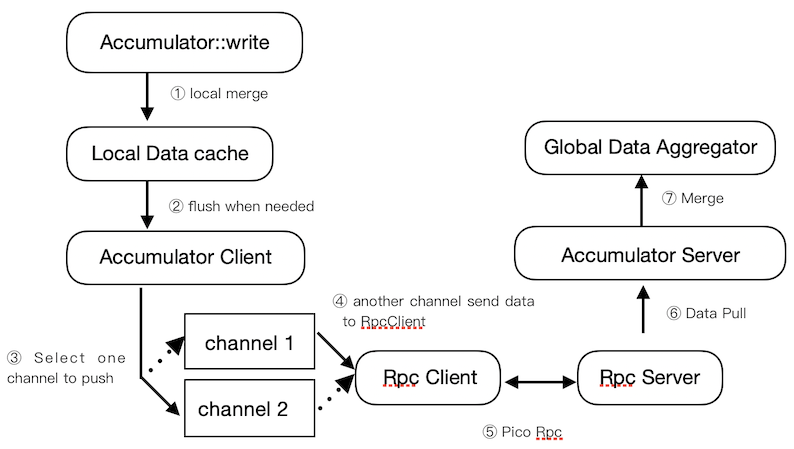
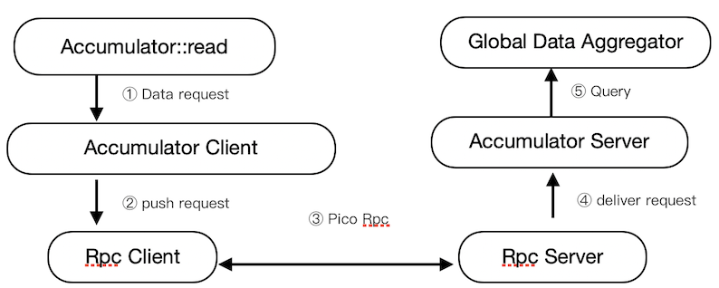

# Accumulator 设计

## 目录

- [Accumulator 设计](#accumulator-设计)
  - [目录](#目录)
  - [名词解释](#名词解释)
  - [Accumulator Write 流程](#accumulator-write-流程)
  - [Accumulator Read 流程](#accumulator-read-流程)

## 名词解释

* Accumulator Server

    每个 Accumulator 需要有一个Accumulator Server 来收集数据与处理请求

* Accumulator Client

    向 Accumulator Server 上传数据与发送请求的客户端，可以与 Accumulator Server 部署在同一个节点

* RpcServer, RpcClient

    RPC 通讯框架的客户端与服务端，详情见[RPC 简介]（../rpc/README.md)

## Accumulator Write 流程 

1. Accumulator 的写操作会将数据发送给本地的缓存
2. 与本地缓存已有的数据进行初步的整合后，定时进行 Flush 操作
3. Accumulator Client 底层有两个 channel，它们轮流负责接收 Accumulator Client Flush 的数据，与将数据发送给 Rpc Client 进行传输
4. 当其中一个 channel 负责接收数据时，另一个则负责发送数据，反之依然
5. 通过 Pico 通讯框架进行高性能通讯
6. Accumulator Server 会负责接收其它节点推送的数据
7. 根据 Accumulator 的具体类型，进行数据的处理，并将结果保存以供查询

## Accumulator Read 流程

1. Accumulator 的读操作会将请求发送给 Accumulator Client
2. Accumulator Client 会将请求 push 到 Rpc Client
3. 通过 Pico 通讯框架进行高性能通讯
4. 将请求送达到 Accumulator Server 进行处理
5. 根据 Accumulator 具体的类型，Accumulator Server 会进行对应的查询操作
