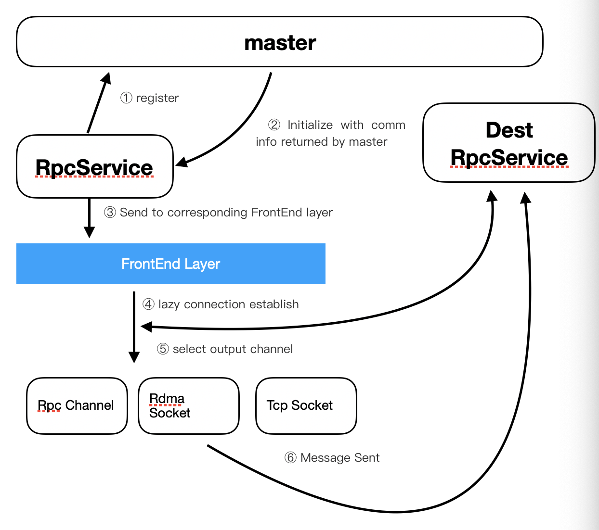
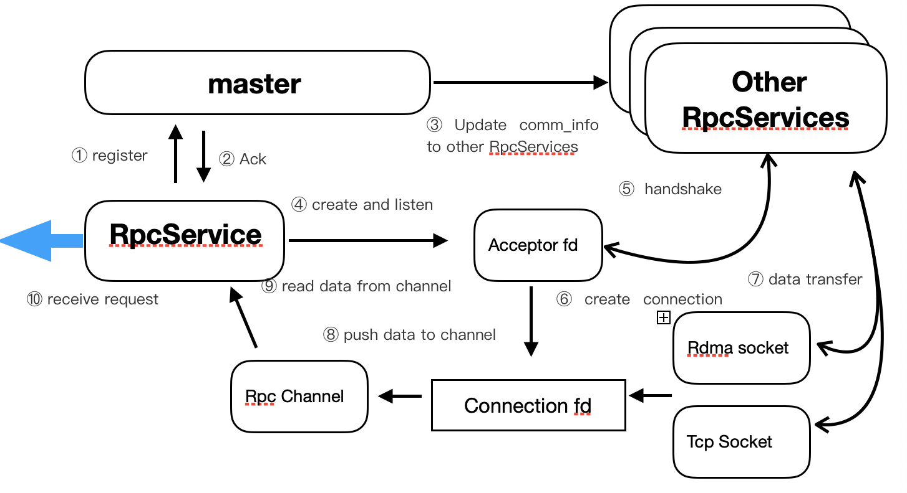
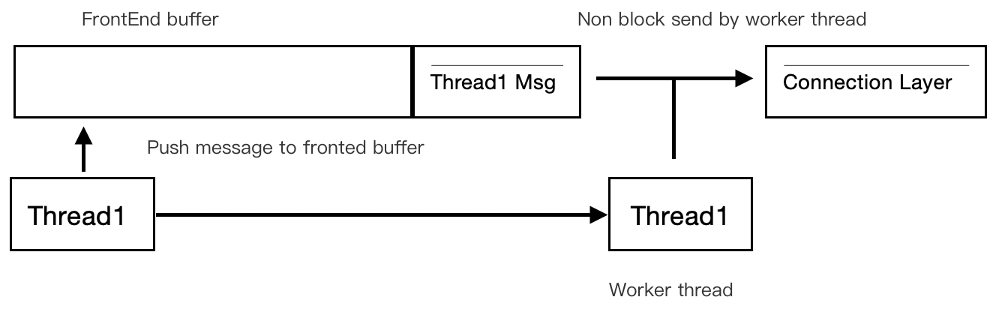
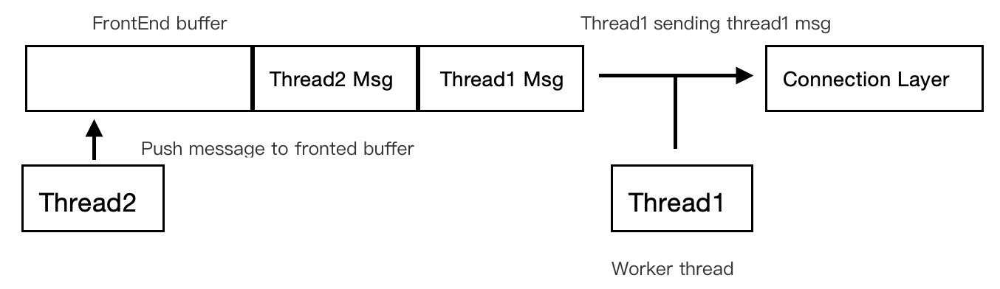
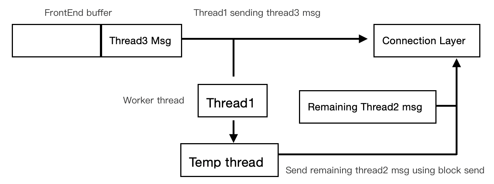
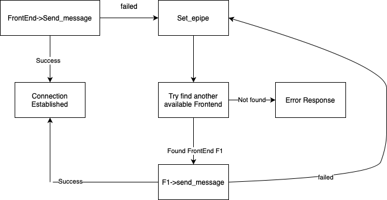

# RPC 设计

## 目录

- [RPC 设计](#rpc-设计)
  - [目录](#目录)
  - [名词解释](#名词解释)
  - [整体流程框架](#整体流程框架)
    - [Client](#client)
    - [Server](#server)
    - [FrontEnd 设计](#frontend-设计)
    - [FrontEnd 异常处理](#frontend-异常处理)

## 名词解释

* Master

    一个全局服务，维护着各个节点 (包括 client 与 server) 的状态，每个节点需要向其注册才能使用。

* RpcService

    一个逻辑节点，该节点上可以启动多个 Server 与 Client，每个节点有唯一的节点 id。

* RpcChannel

    从多个通讯渠道（socket, RDMA) 中读取数据，并推送进缓冲区，从而保证通讯效率与线程安全。

## 整体流程框架

### Client

1. 创建新的 RpcService 并向 master 注册。
2. Master 收到 client 注册请求，并返回全局的 RpcService 信息，包括节点数量，节点名称，以及每个节点上注册的服务数量和地址等信息。
3. RpcService 将这些信息接受后，与自身要连接的 server 信息相比对，并将这些信息传递给 FrontEnd Layer 层进行后续的连接发动等操作。
4. FrontEnd 与目标节点进行惰性连接，只有在信息需要发送过去的场合才会与目标节点进行握手，并管理该连接，保证服务的可靠性。
5. FrontEnd 根据节点设置与网络拓扑，决定底层的传输协议，若服务端也在本节点的话，可以直接走 RPC Channel 将消息发送到服务端，否则需要经过 socket, RDMA 等将消息发送到对方节点上去。
6. 将消息通过对应的传输协议传输到目标节点。

### Server

1. 创建新的 RpcService 节点并向 master 注册。
2. master 收到 server 注册请求后，会返回确认信息。
3. 随后 master 会向所有节点广播该 server 的节点 id, 地址，服务数量等信息，以方便其它节点连接该服务 。
4. server 所在的 RpcService 节点会创建并持续监听 acceptor fd。
5. 其它 RpcService 节点的客户端会使用该文件来建立与 server 的连接。
6. 针对每个监听到的连接，都会根据节点配置与网络拓扑建立新的 connection fd 来收发数据，一个 connection fd 对应一个连接。
7. 客户端通过不同的传输协议（RDMA,socket）等，将数据发送到该 connection fd 上。
8. connection fd 收到消息后，会触发事件，并将收到的数据填入 RpcChannel 中。
9. server 端通过 recv_request() 从 RpcChannel 中获取数据。
10. 完成数据接收。

### FrontEnd 设计

prpc 为了优化响应时间与通讯效率，对于消息的发送采用了无阻塞的模式，具体实现如下：

frontend针对每个server都存在对应的缓冲区，当线程 (Thread1) 发送消息时，首先将自身的消息推送入该缓冲区，若此时缓冲区内没有其它线程在搬运消息，则该线程自身便承担搬运消息的职责，搬运时采用的非阻塞调用，直至清空缓冲区。我们称该线程为工作线程。

当线程（Thread2）发送消息时，在其推送消息进入缓冲区后，若其监测到对应的缓冲区已经存在工作线程（Thread1)，则可以直接返回。

由于工作线程搬运数据时采用非阻塞调用，因此若某一条消息过大，无法在一次调用中全部搬运完成时，为了保证响应时间，工作线程会创建专门的线程（Temp thread)来搬运余下的内容，自身开始处理缓冲区中的下一条消息。

通过这样的方式，在消息发送时保证线程安全，并尽量减少线程切换，内存拷贝，尽量避免 cache miss。

### FrontEnd 异常处理

client 端发送 request 时的异常处理如下图所示：

当因为网络或其它原因，导致 FrontEnd 发送失败时，其会将当前的状态设置成 EPIPE 并搜寻是否有其它注册了该服务的 FrontEnd 可供发送，如果有，则交由该 FrontEnd 进行发送，否则返回失败信息。

