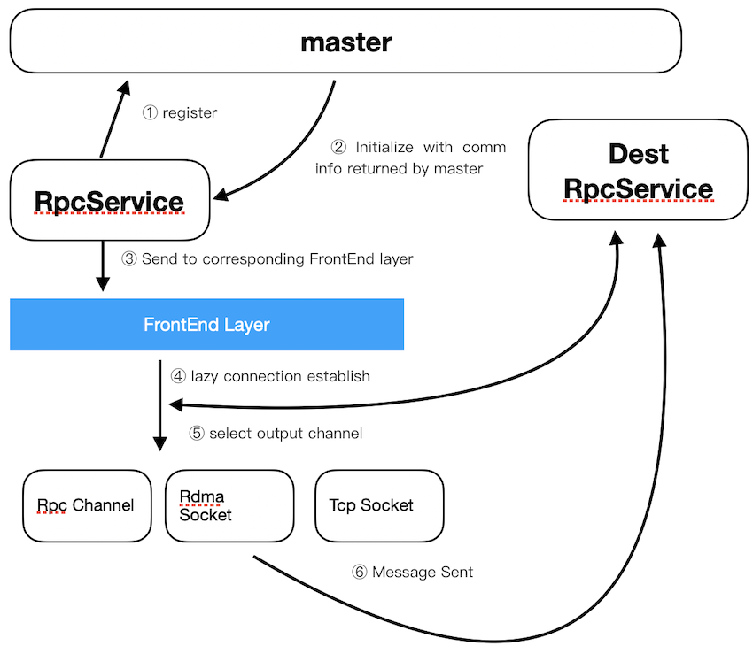
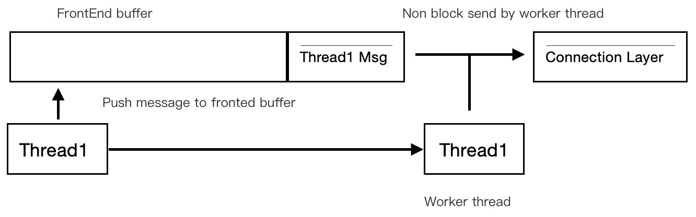
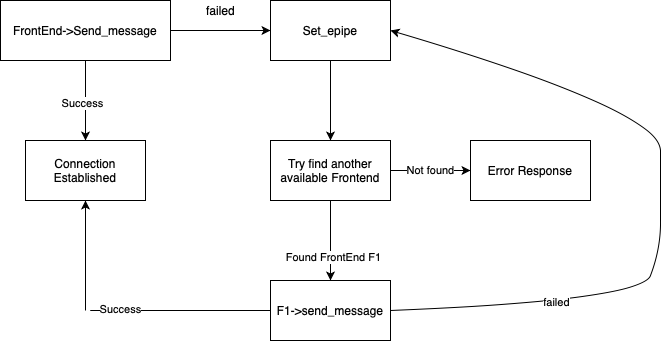

# RPC 设计

[English version](Design.md) | 中文版

## 目录

- [RPC 设计](#rpc-设计)
  - [目录](#目录)
  - [Client](#client)
  - [Server](#server)
  - [FrontEnd](#frontend)
  - [异常处理](#异常处理)

## Client

1. 初始化 `RpcService` 并向 `Master` 注册。
2. `Master` 收到注册请求，并返回全局的 `RpcService` 信息，包括每个节点的编号，地址，和节点上注册的服务等信息。
3. `RpcService` 根据返回的信息为每个服务节点创建 `FrontEnd`。
4. `FrontEnd` 只有在信息需要发送过去的场合才会与目标节点进行连接，并管理该连接，保证服务的可靠性。
5. 若服务端也在本节点的话，消息可以直接移动到服务端，否则消息需要经过 TCP 或 RDMA 网络。
6. 将消息发送到目标服务节点。

## Server

1. 初始化 `RpcService` 并向 `Master` 注册。
2. `Master` 收到注册请求后，会返回确认信息。
3. 随后 `Master` 会向所有节点广播该节点的编号, 地址，服务数量等信息。
4. `RpcService` 创建并持续监听 acceptor fd 描述符。
5. 其它节点向该节点发起发起连接。
6. 针对每个监听到的连接，都会根据节点配置与网络拓扑建立新的 connection fd 来收发消息。
7. 其他节点通过 TCP, RDMA 等协议，将消息发送到该节点。
8. connection fd 收到消息后，会通知接收线程，并将收到的消息填入 `RpcChannel` 中。
9. 通过 `recv_request()` 从 `RpcChannel` 中获取数据。
10. 完成消息接收。

## FrontEnd

为了优化响应时间与通讯效率，对于消息的发送采用了无阻塞的模式，具体实现如下：

`FrontEnd` 使用了线程安全的缓冲区（多生产者单消费者），当某个线程 (Thread1) 发送消息时，首先将自身的消息推入缓冲区，若此时缓冲区内没有其他的消息，则该线程会发送所有被推到缓冲区的消息，直至清空缓冲区。该线程被称为工作线程。

当另一个线程（Thread2）发送消息时，在其推送消息进入缓冲区后，若其监测到对应的缓冲区已经存在工作线程（Thread1)，则可以直接返回，消息由工作线程发送。

由于发送数据时采用非阻塞调用，因此若某一条消息过大，无法在一次调用中全部发送完成时，为了保证响应时间，工作线程会创建临时的线程来发送余下的内容，自身开始处理缓冲区中的下一条消息。

通过这样的方式，在消息发送时保证线程安全，并尽量减少线程切换，内存拷贝，尽量避免 CPU cache miss。

## 异常处理

客户端 `send_request` 时的异常处理过程如下图所示：

当因为网络或其它原因，导致 `FrontEnd` 发送失败时，其会将当前的状态设置成 EPIPE 并搜寻是否有其它可访问同一服务的 `FrontEnd` ，如果有，则交由该 `FrontEnd` 发送，否则立刻返回一条错误消息。
